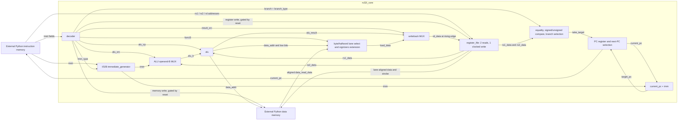

# v0.4 Single-cycle Datapath

Implemented checkpoint: DAY17, 2026-09-20. Source top: `rtl/rv32i_core.sv`.
The boxes inside the core are synthesizable logic. Both memory models below
are cocotb/Python testbench components, not RTL RAMs.

The v0.4 datapath keeps the v0.1 single-cycle structure. The decoder selects
XOR, unsigned comparison, register/immediate shifts, six branch types, and the
byte/halfword load/store group. Jumps and pipeline registers remain outside
this checkpoint.

PC's sequential alternative is `current_pc + 4`; reset overrides both choices
and sets PC to 0 at a rising edge. The register file has no reset. The diagram
omits the shared clock wiring and individual reset-gating gates for readability.

## Instruction-to-state sequence

1. The testbench reads `current_pc` and supplies the instruction word.
2. Instruction fields select register addresses and decoder controls. The
   immediate generator assembles the selected I/S/B immediate.
3. Register reads and operand selection settle combinationally. The ALU computes
   arithmetic/logical results or the memory effective byte address.
4. For a load, the environment aligns the effective address, assembles a
   little-endian 32-bit word, and supplies `data_read_data` before the rising
   edge. The lane selector chooses the byte/halfword and sign- or zero-extends
   it; LW uses the whole word.
5. For a store, the core places the payload in the selected byte lanes and
   asserts `data_write_strb`; the testbench applies only those lanes at the
   committing edge, preserving the others.
6. At the rising edge, enabled register writes and the PC update commit.

This is an event sequence through one single-cycle datapath, not pipeline stages.

## Branch path

The core computes equality, signed less-than, and unsigned less-than directly.
`branch_type` selects BEQ, BNE, BLT, BGE, BLTU, or BGEU, with inverse
selection for the greater-or-equal forms. Although the decoder selects ALU SUB
for branches, the branch decision does not consume an ALU zero flag. The target
adder uses the **current branch PC** plus the B immediate. No supported branch
enables register-file or external data-memory writes.

## Subword memory path

`data_addr` is the full 32-bit ALU effective byte address. Its low two bits
select one of four byte lanes in the aligned external word. LB/LBU select one
byte and sign/zero-extend it; LH/LHU select lanes 0/1 or 2/3 and sign/zero-
extend them. SB emits one strobe and lane-aligned data; SH emits two adjacent
strobes; SW emits all four. The contract permits any byte address for byte
operations, even addresses for which a word access would be misaligned.

The core has no internal memory and no cross-word assembly/split path. A
halfword or word access that is misaligned under the documented limits is
unsupported and unverified, with no misalignment exception.

## Why an array becomes flip-flops and MUXes

`register_file.sv` declares 32 words of 32 bits. The v0.4 generic synthesis
reported 1024 enabled single-bit flip-flops and 1984 MUXes in this module.
Two independent read addresses require two data-selection networks. A binary
32-to-1 selection tree has 31 two-input MUXes per bit; `31 * 32 * 2 = 1984`
matches this run. This is an explanation of the observed structure, not a
guarantee that every synthesis configuration will produce identical cells.

No memory objects remained after mapping; storage did not disappear. No SRAM
macro was selected. Architectural x0 behavior is implemented by the RTL's
read bypass/write protection; do not infer that synthesis must remove exactly
32 storage cells for x0.

## Timing boundary

Addresses changing at a read port propagate through combinational selection;
reads do not wait for a clock edge. Writes do. The overall load path may include
register read, ALU address generation, external memory, and writeback. That is
a candidate path to analyze later, not a measured critical path. See
[synthesis.md](synthesis.md) for what has and has not been measured. The
current v0.4 hierarchy reports 6142 generic cells; the v0.3 count of 5456 and
earlier v0.2 count of 5372 are historical. These are generic structural counts,
not physical area, Fmax, or STA.
