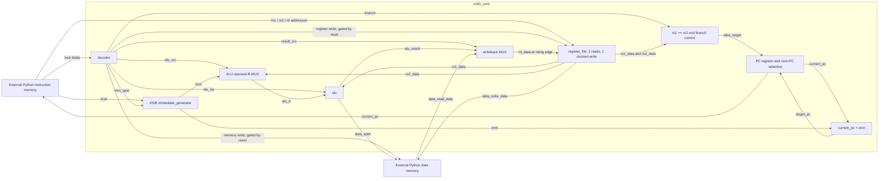

# v0.1 Single-cycle Datapath

Implemented checkpoint: DAY14, 2026-09-15. Source top: `rtl/rv32i_core.sv`.
The boxes inside the core are synthesizable logic. Both memory models below
are cocotb/Python testbench components, not RTL RAMs.

PC's sequential alternative is `current_pc + 4`; reset overrides both choices
and sets PC to 0 at a rising edge. The register file has no reset. The diagram
omits the shared clock wiring and individual reset-gating gates for readability.

## Instruction-to-state sequence

1. The testbench reads `current_pc` and supplies the instruction word.
2. Instruction fields select register addresses and decoder controls. The
   immediate generator assembles the selected I/S/B immediate.
3. Register reads and operand selection settle combinationally. The ALU computes
   arithmetic/logical results or the LW/SW address.
4. For LW the environment supplies `data_read_data` before the rising edge.
   The writeback MUX selects that data; otherwise it selects the ALU result.
5. At the rising edge, enabled register writes and the PC update commit. The
   testbench applies an enabled SW using the transaction sampled for that edge.

This is an event sequence through one single-cycle datapath, not pipeline stages.

## Branch path

BEQ uses an explicit rs1/rs2 equality comparison in the core. Although the
decoder selects ALU SUB for BEQ, the branch decision does not consume an ALU
zero flag. The target adder uses the **current branch PC** plus the B immediate.
Neither register-file nor memory writes are enabled by BEQ.

## Why an array becomes flip-flops and MUXes

`register_file.sv` declares 32 words of 32 bits. The DAY13 generic synthesis
reported 1024 enabled single-bit flip-flops and 1984 MUXes in this module.
Two independent read addresses require two data-selection networks. A binary
32-to-1 selection tree has 31 two-input MUXes per bit; `31 * 32 * 2 = 1984`
matches this run. This is an explanation of the observed structure, not a
guarantee that every synthesis configuration will produce identical cells.

No memory objects remained after mapping; storage did not disappear. No SRAM
macro was selected. Architectural x0 behavior is implemented by the RTL's
read bypass/write protection; do not infer that synthesis must remove exactly
32 storage cells for x0.

## Timing boundary

Addresses changing at a read port propagate through combinational selection;
reads do not wait for a clock edge. Writes do. The overall load path may include
register read, ALU address generation, external memory, and writeback. That is
a candidate path to analyze later, not a measured critical path. See
[synthesis.md](synthesis.md) for what has and has not been measured.
